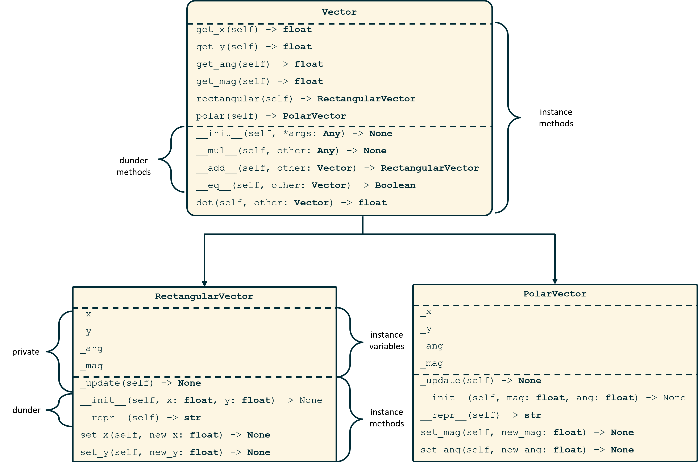

# Hw 02 - Object-Oriented Programming

Implement a class diagrams in code for Rectangular and Polar vectors.

Terminology review:

* **inheritance** - A child class inherits from its parent (`class Child(Parent)`) to get access to all attributes of the parent. Represents *is-a* relationships. Generally, the child class specializes the parent class through one or more of:
    * **overloading** - a child class re-defines a method, so intances of the child will use that version of the method instead.
    * **extending** - a child class adds variables or methods not availble to the parent

* **composition** - Objects of another class are added to objects of this class, often during initalization. Represents *has-a* relationships.
* **instance** or **bound** variables- variables that are bound to an instance of this class. Example: variables you add during `__init__`. Accessed via dot notation: `my_obj.var1`
* **instance** or **bound** methods - methods that are bound to an instance of this class. Their first parameter is `self`: `my_obj.foo()` calls the bound method `foo()`, passing in `my_obj` as the first parameter, `self`.
* **private** variables or methods - names that begin with one underscore are "private" - these *should not* be accessed outside of the class they are defined in (e.g. a user should not call `my_obj._foo()`).
* **magic** or **dunder methods** - methods that begin and end with double underscores (`__`). Called "magic" because they are called in "magic" ways, e.g. `x + y` instead of `x.__add__(y)`. These are not "private", but you *should not* call them by their names (e.g. use `len(L)` instead of `L.__len__()`).


## Part 1 - Vectors



We can implement 2-D vectors in rectangular (x, y) or polar (magnitude, angle) coordinates. While we could create 2 independent classes `RectangularVector` and `PolarVector`, we'd end up with a lot of duplicate work - they code for e.g. adding two vectors together or checking if two vectors are equal would be identical. Instead, we will factor out similar code to a parent class called `Vector`.

Something special about `Vector` is that it *only* exists for factoring out code - users cannot directly create a `Vector` object, since a vector must be either `Rectangular` or `Polar`. To emphasize this point, `Vector.__init__()` will contain a single line: `raise NotImplementedError()`, redirecting wayward users that try to create a `Vector` object to use `RectangularVector` or `PolarVector` instead.

Some equations that may be helpful:

* Magnitude from rectangular coordinates: $magnitude = \sqrt(x^{2} + y^{2})$
* Angle from rectangular coordinates: $\theta = atan(y/x)$ 
* x coordinate from polar: $x = magnitude \times cos(\theta)$
* y coordinate from polar: $y = magnitude \times sin(\theta)$

For this assignment, you can import `sqrt`, `atan`, `cos`, and `sin` from the `math` module.

### `class Vector`

We will use a parent class called `Vector` to factor out all the similar code from its children `RectangularVector` and `PolarVector`. To ensure we can easily get the attributes we need for e.g. adding or comparing two vectors, `Vector` should support the following "getter" functions:

* `get_x()` - returns the x-component of this vector
* `get_y()` - returns the y-component of this vector
* `get_mag()` - returns the magnitude of this vector
* `get_ang()` - returns the angle of this vector *in radians*.

Note that the code you write here should be *independent* of the specific type of vector.
As an example:

```python
class Vector:
    def get_x(self):
        """Returns the x-component of this vector"""
        return self._x # RectangularVector and PolarVector both store _x, so this
                       # works regardless of the type of self.
```

`Vector` should also support the following methods (listed in the order we suggest working on them, since the autograder uses some of these methods to validate others):

* `__eq__()` - Returns `True` if `self` and `other` are equal; `False` otherwise. To account for rounding, we will treat any two vectors as equal if their `x-` and `y-` coordinates are equal to 3 decimal points.
* `__add()__` Returns a `RectangluarVector` equal to the sum of the two passed in vectors. To find the sum of two vectors, find the sum of their x- components (this is the x-component of the sum) and the sum of their y-components (this is the y-component of the sum). E.g. `(3, 4) + (1, 5) = (4, 9)`. Note that this method should work for `Polar` and `Rectangular` vector objects - use `get_x()` and `get_y()`, since both types support these getters.
* `rectangular()` - returns a `RectangularVector` object equal to this object.
* `polar()` - returns a `PolarVector` object equal to this object.

* `dot()` - returns the dot product of `self` and `other`. The dot product is the sum of `self.x*other.x` and `self.y*other.y`.

Finally, we have two methods that users should never use in `Vector`. These methods need to explicitly raise a `NotImplementedError` and pass along a message to the user explaining *why* this method isn't implemented and what they should do instead:

* `__init__()` - provided for you as an example
* `__mul__()` - "Multiplication" is ambiguous for vectors. We are defining the dot product, but a user could easily think multiplication should return a cross product. Raise a `NotImplementedError` that prints a string telling the user to use `dot` instead if they want to find a dot product, and that cross products are not yet supported.

### `class RectangularVector(Vector)`

This class should inherit from `Vector` and not overload any methods besides `__init__`.

We will store the x- and y-components for these objects as well as their magnitude and angle. The magnitude and angle must be updated everytime a user changes the x- or y-components. To ensure this happens every time, we will:

* store x, y, magnitude, and angle in *private* attributes
* provide public setter functions (e.g. `set_x()`) for users to update the x- and y- components
    * recalculate and update the magnitude and angles during these setter functions

As an example, this is how we would solve a similar problem storing the area of a circle object with a changeable radius:

```python
class Circle:
    def __init__(self, radius):
        self._radius = radius
        self._update() # calculates and stores area

    def _update(self):
        self._area = math.pi * self.radius**2

    def set_radius(self, new_radius):
        self._radius = new_radius
        self._update()  # recalculates area
```

Your solution should be similar:

* In `__init__`, store `_x` and `_y` explicitly, then call `_update` to calculate and add `_mag` and `_ang` instance variables
* Create setter methods for `_x` and `_y` that set the relevant variable, then call `_update()` to recalculate the magnitude and angle.

Additionally, add a `__repr__` function that **returns** a string representation of this object:

```python
>>> rv1 = RectangularVector(3, 4)
>>> repr(rv1) # returns a string
RectangularVector(3, 4)
```

### `class PolarVector(Vector)`

Implement this similarly to the `RectangularVector`, but you should now initialize and provide setters for magnitude and angle, while updating `x` and `y` when a user sets either of `mag` or `ang`.

The class diagram shown earlier has almost all of the information you need to complete this assignment - it's a great reference if you're unsure what a function should be called, what it's parameters are, or what it should return.

## Grading

We will manually grade *readability* and *structure* on this assignment.

* Readability hints - make good use of :
    * docstrings (*every* method needs one)
    * names (for variables and functions)
    * whitespace (spacing within a line, and spacing between lines)
    * comments can help readability, but don't go overboard - most of the work on readability can be achieved with the previous three items.

* Structure hints:
    * Keep your code D.R.Y.: **D**on't **R**epeat **Y**ourself. The structure shown in the class diagram will help with this.

## Submitting

Submit the following files:

*	`vector.py`

Students must submit to Gradescope individually within 24 hours of the due date (homework due dates are typically Tuesday at 11:59 pm EST) to receive credit.
