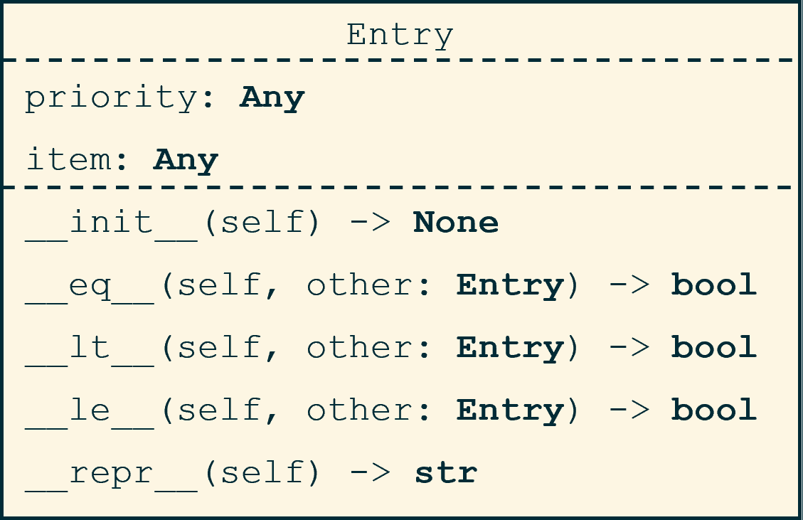
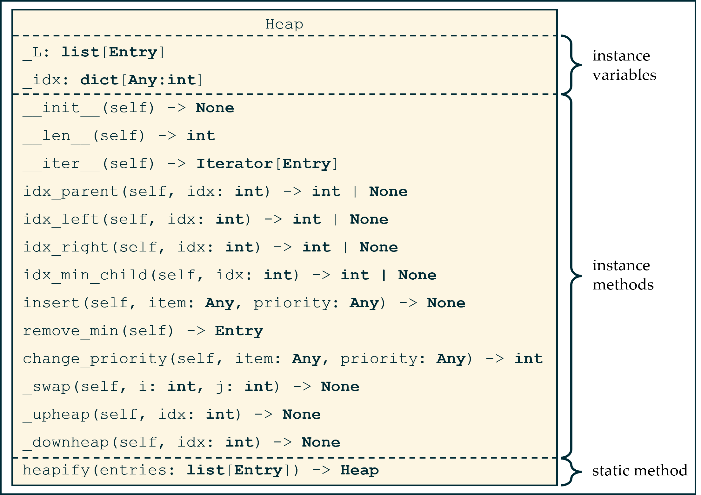

# Mod 10 Homework - Heap and Heapsort

## Part 1 - `entry.py`

Implement a class `Entry` according to the following UML diagram:



For the comparators `==`, `<`, and `<=`, compare entries based on their priorities (e.g. one entry is less than another if its priority is less). See the provided unittest for the expected format of `repr`.

\pagebreak

## Part 2 - `heap.py`

Implement a class `Heap` according to the following UML diagram:



* `_idx` is a dictionary of `item:index` pairs, where `index` is the position of the entry containing this item in `self._L`. This allows us to find the entry containing a given item in $O(1)$. Make sure to update this dictionary every time an entry changes position, so you always know where items are stored.
    
    We assume that there are no duplicate items added, so the value of `_idx[item]` is unique. This index of this item will change whenever you upheap or downheap it, so make sure to update `_idx[item]` whenever you do so. The easiest way to be consistent is to only move items in one method - `Heap._swap()`.

    Add items to this dictionary when you add them to the heap and remove them when you remove from the heap.

* `__iter__()` should yield the minimum entry until the heap is empty. Make sure to call `remove_min()` for the items you yield, so the heap will eventually be empty.

* `idx_parent`, `idx_left`, and `idx_right` should return the indicated indices or `None` if the expected nodes are not in the heap (e.g. at index 0, the parent is `None`, and if an entry does not have a right child, `idx_right` should return `None`).

* `change_priority` should change the priority of a given item to the priority passed in. Use `_idx` to find the item in $O(1)$, then update its priority and upheap or downheap, as appropriate, until the array is heap-ordered again. It should return the new index of the item (e.g. if an item ends up at index 17 after heap-ordering, return 17).

* `heapify()` creates and returns a heap out of a passed in list of `Entry` objects. It should work in $O(n)$.

    This is a *static method* - it is associated with the class `Heap`, but it is not bound to a specific instance of this class.
    
    * We denote that something is a static method with the decorator `@staticmethod`.

    * Static methods do not take an instance of the class as the first paramter. E.g. we will call `Heap.heapify(entries)` rather than `h.heapify(entries)` 
    
    * Because there is no instance bound to this method, we will not include `self` as a parameter:
    ```python
    class Heap:
        ...
        @staticmethod
        def heapify(entries):
            """"""
            # Note that it's not `heapify(self, entries)`
    
    ```

\pagebreak
## Part 3 - `heapsort.py`

Finally, we will implement the `heapsort` algorithm. We will not use an explicit `Heap` class here, rather, we will define functions that manage an array as if it were a heap.

Heapsort works by:

* Creating a max-heap out of an array of values (similar to `heapify`)
* Until the heap is empty:
    * Swap the maximum item (at index 0) with the final item
    * Decrease the length of the heap by 1 (but don't pop off the final item)
    * Downheap the item at index 0 until the remaining heap is heap-ordered

`heapsort` is an in-place O(nlogn) sorting algorithm. We can't quite use the exact methods we defined earlier, since the heap we want here has a few differences:

* we are heaping items, not priority:item pairs
* We don't want to call `self._L.pop()` during `downheap`, since we want to keep the sorted items in our list

In fact, we won't be using an explicit `Heap` class at all. Implement just these functions in `heapsort.py` (as *functions*, not as methods in a class):

* `idx_left(L: list[Any], idx: int, right: int)` - return the index of the left child of `idx`, or `None` if that is not less than `right`.

* `idx_right(L: list[Any], idx: int, right: int)` - return the index of the right child of `idx`, or `None` if that is not less than `right`.

* `idx_max_child(L: list[Any], idx: int, right: int)` - return the index of the max child of `idx`, or `None` if that is not less than `right`.

* `swap(L: list[Any], i: int, j: int)` - swaps the items at indices `i` and `j`

* `downheap(L, idx, right)` - repeatedly downheaps the item at index `idx` until the array is heap-ordered from `idx:right`, excluding the item at index `right`.

* `heapsort(L: list[Any])` - implements the `heapsort` algorithm:
    * Create a max-heap in $O(n)$.
    * Until L is a sorted array:
        * Swap the max item with the end of the heap
        * Decrement the length of the heap-portion of `L` by 1
        * Downheap until the heap-portion of `L` is heap-ordered

With the exception of `heapsort()`, these methods will all be similar to their counterparts in `heap.py`. Make sure to implement a max-heap here - a min-heap will leave you with an array in descending, rather than ascending, order.

\pagebreak
## Submissions

At minimum, submit the following:

* `entry.py`
* `heap.py`
* `heapsort.py`

Submit to Gradescope individually within 24 hours of the due date (Friday 11/22 at 11:59 pm EST) to receive credit.

## Grading

This assignment is largely autograded, but we will be manually grading to ensure algorithms are correct and efficient. You are provided with some test cases, and we encourage you to write your own for debugging purposes.