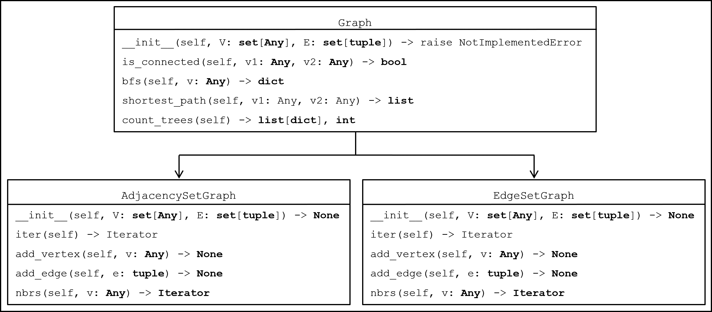

# Module 11 Homework - Graphs

## Overview

1) Implement non-directional, non-weighted graphs with appropriate data structures in `AdjacencySetGraph` and `EdgeSetGraph` classes.

2) Implement a parent class `Graph` with methods that are independent of the underlying data structures:



The `Graph` class is a convenient way to factor out common functionality, but should not be used on it's own - users should specify an `AdjacencySetGraph` or `EdgeSetGraph`. We expliciltly raise a `NotImplementedError` in `Graph.__init__` to ensure this.

## AdjacencySetGraph and EdgeSetGraph Classes

Using the appropriate data structure, implement the following ADT for classes `AdjacencySetGraph` and `EdgeSetGraph`:

* `__init__(V, E)` - initialize a graph with a set of vertices and a set of edges (we'll use tuples as edges, so E should be a set of tuples). Both parameters should be optional.
* `__iter__()` - returns an iterator over all **vertices** in the graph.
* `add_vertex(v)` - adds a vertex to the graph.
* `add_edge(e)` - adds an edge to the graph.
* `nbrs(v)` - returns an iterator over all neighbors of `v`.

\pagebreak

## Graph Class

This class is used for methods whose implementations do not depend on the underlying data structure. Both `AdjacencySetGraph` and `EdgeSetGraph` will inherit these methods from `Graph`.

* `is_connected(v1, v2)` - returns True (False) if there is (is not) a path between `v1` and `v2`.
* `bfs(v)` - returns a breadth-first search tree. You must return the tree in a dictionary, see chapter 21 in the [textbook](https://donsheehy.github.io/datastructures/fullbook.pdf) for more info.
    * *Be careful about efficiency here* - use an efficient queue.
* `shortest_path(v1, v2)` - returns the shortest path between v1 and v2.
    * A path is a list of vertices that can be visited in sequential order, e.g. `[va, vb, vc, vd]` is the path represented by the 3 edges `(va, vb)`, `(vb, vc)`, and `(vc, vd)`.
    * The length of a path in an unweighted graph is the number of edges it contains. The path above has a length of 3.
* `count_trees()` - We will use "trees" to describe isolated structures within an overall graph, or "forest". For instance, here are 5 examples of forests with different amounts of trees:

    ```
    1 tree      |  2 trees     |  3 trees   |  4 trees   |  5 trees
    ==========  |  ==========  |  ========  |  ========  |  =========
    A--B  D--E  |  A--B  D--E  |  A  C  E   |  A C D E   |  A B C D E
    | /      |  |  | /         |  |  |      |  |         | 
    C--------+  |  C           |  B  D      |  B         | 
    ```

    `count_trees()` should return a list of distinct trees in a graph as well as the number of trees. To do this:
    * For each unvisited vertex in the graph:
        * Perform a breadth first search, adding the resulting tree to a list of trees
        * Add any nodes in the resulting tree to a set of visited vertices

    ```python
    >>> V = {'A', 'B', 'C', 'D', 'E'}
    >>> E = {('A', 'B'), ('A', 'C'), ('B', 'C'), ('C', 'E'), ('D', 'E')}
    >>> g = AdjacencySetGraph(V, E)
    >>> trees, count = g.count_trees()
    >>> print(trees)
    [{A:None, B:A, C:A, E:C, D:E}]
    >>> print(count)
    1
    >>> g2 = ... # construct the 2-tree graph above
    >>> trees, count = g2.count_trees()
    >>> print(trees)
    [{A:None, B:A, C:A}, {D:None, E:D}]
    >>> print(count)
    2
    ```

\pagebreak
## Tests

Most of your tests should go in a factory inhereted by `TestAdjacency` and `TestEdge`.

```python
class GraphTestFactory: ...

class TestAdjacency(GraphTestFactory, unittest.TestCase): ...

class TestEdge(GraphTestFactory, unittest.TestCase): ...
```

At minimum, write the following unittests in the factory:

* **Graph Construction** Create an empty graph, then add vertices and edges. 

* **Graph Construction in `init`**. As above, but pass the set of vertices `V` and `E` during initialization.

* **`is_connected_simple`**. For every vertex in a graph, test that:
    * That vertex *is* connected to all expected vertices (at least one vertex more than one edge away).
    * That vertex *is not* connected to all expected vertices (at least one non-connected pair of vertices).

* **`is_connected_cycle`** - As above, but include a cycle to ensure you don't fall into infinite loops.

* **`bfs`**.  `bfs` is not guaranteed to return the same tree every time. It *is* guarnateed to return a tree that connects the source vertex to every other vertex with a minimum path, so we will test that instead.
    1) Construct a dictionary of the *expected* minimum distance of every vertex from your source.
    2) Call bfs to get a tree.
    3) Calculate the *actual* distance of every vertex from your source in the resulting tree.
    4) Compare expected and actual values.

    ```python
    def test_bfs(self):
        G = self.graph_ds(V = {...}, E = {...})
        dist_from_A_expected = {'A': 0, 'B':1, 'C':1, 'D':2, 'E':3}
        tree = G.bfs('A')

        dist_from_A_actual = dict()
        for child in tree:
            # Calculate the number of edges to get back to the source vertex
            dist_from_A_actual[child] = VALUE_YOU_JUST_CALCULATED

        self.assertEqual(dist_from_A_actual, dist_from_A_expected)
    ```

* `count_trees` - as above, do not test that you get a specific tree back. Instead, test that each of your trees contains only the expected vertices (regardless of order) and that you have the expected number of trees.

* `shortest_path` - Again, we are not guarnteed to get a fixed path here. Test that 1) the path is valid for that graph (all the edges in the path exist), and 2) the length of the path is correct.

Additionally, add a non-factory class with a single unittest - that calling `Graph.__init__()` raises a `NotImplementedError`.

## Imports

No imports allowed on this assignment, with the following exceptions:

* Any modules you have written yourself
* `queue.Queue` for efficient queues (you can also use a linked list you have written yourself). Be careful with this class - by default, looping over these objects pause indefinitely (instead of terminating) when the collection becomes empty.
* `typing` - this is not required, but some students have requested it
* For testing only (do not use these for functionality in any other classes/algorithms):
    * unittest
    * random

## Submission

At a minimum, submit the following files:

* `Graph.py`
    * `class Graph`
    * `class AdjacencySetGraph`
    * `class EdgeSetGraph`
* `TestGraph.py`
    * see above for information on structuring your tests

Students must submit individually within 24 hours of the deadline (typically 11:59 PM EST Tuesday) for credit.

## Grading

This assignment is partially manually and partially automatically graded.