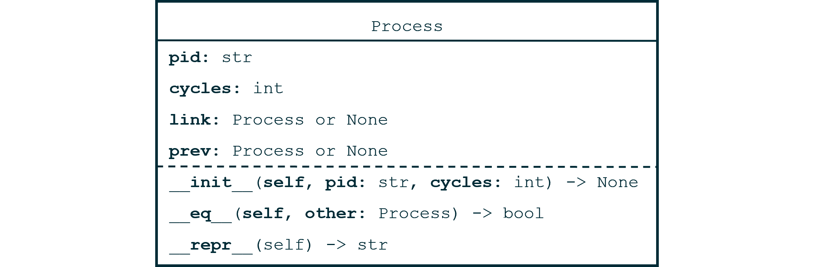

# Mod 04 Homework - Circular Queue


Implement a Circular Queue ADT to simulate an operating system juggling multiple processes on a single CPU. Your CircularQueue will be similar to a doubly linked list, with Processes serving as nodes, except for a few changes:

* There is no tail attribute, only a head.

* The `link` attribute of the "final node" should circle back to the head.

* The `prev` attribute of the head should connect to the "final node."

* Support O(1) removal of arbitrary nodes by keeping track of a dictionary of `pid:process` pairs.


In this assignment, we are assessing your ability to implement a linked data structure *and* your ability to use test-driven development. A large portion of your grade will be manual, and we are not providing much automated feedback via Gradescope. Write test cases as you go and implement one piece of functionality at a time.

\pagebreak

## Part 1- Process



* `pid: str` - a unique process identifier.

* `cycles: int` - Number of clock cycles required to complete this process. This should be an optional parameter in `init` with a default value of 100. 

* `link` - link to the next process in a circular queue. This should not be a parameter in `init`, but you should set it to `None` when a process is created (e.g. `self.link = None`).

* `prev` - as above, but for the previous process.

* `eq` - Two processes are equal if they have the same `pid`.

* `repr` - see example below.

```python
>>> p1 = Process('send_email') # only pid specified
>>> p2 = Process('A', 400) # optional paramter cycles specified
>>> p1.pid, p1.cycles, pl.link, p1.prev
send_email, 100, None, None
>>> p2.pid, p2.cycles, p2.link, p2.prev
A, 400, None, None
>>> print(p1)
Process(send_email, 100)
```

### Tests

Include at least these four unittests:

* Creating a process with just a name (check the attributes `pid`, `cycles`, `link`, and `prev`)
* Creating a process with a name and cycles
* `eq()` - two different process objects with the same `pid` compare as equal (use `self.assertEqual()`); two process objects with different `pids` compare as not equal (use `self.assertNotEqual()`)
* `repr()`

\pagebreak

## Part 2 - CircularQueue


* `_head` - first process in queue, `None` in an empty queue.

* `_len` - number of processes in queue.

* `repr()` - see examples below

* `add_process()` - adds process to end of queue (just before `self._head`). If a process is the only process in a circular queue (i.e. `len(self) == 1`), it's `link` and `prev` attributes should point to itself (see diagram below).

* `remove_process()` - removes **and returns** a specified `Process` from the queue. Note that the input here is the actual `Process` object which should be removed, not its `pid`. See `kill()` for removing based on `pid`.

* `kill()` - removes **and returns** a process with the given `pid`. To make this O(1), add a dictionary to the queue `self._d_processes` that maps `pid`s to `Process` objects. This dictionary will need to be updated whenever you add or remove a process. See Figure 1 for an illustration.


### Tests

Include at least these 11 unittests:

* `init`
    * initialize empty CQ
    * initialize a CQ with a list of `Process` objects

* `add_process`
    * Add one process to empty CQ
    * Add two processes to empty CQ
    * Add three processes to empty CQ

* `repr`
    * Test that you get the correct string result from a queue of 3 processes.

* `remove_process`
    * From middle of CQ with 3 or more processes
    * From front of CQ with 3 or more processes
    * From end of CQ (just before `self._head`) with 3 or more processes
    * From CQ with exactly 1 process

* `kill`
    * kill a process in the middle of a CQ with 3 or more processes

#### Testing guidelines

Your tests should check a few things whenever you add or remove a process:

* that the length of the queue is correct

* that the head is the correct process

* for each process in the queue, that:
    * this is the expected process
    * process.link is the expected value
    * process.prev is the expected value

It's helpful to factor out the last three bullets into their own method, since it will be called frequently. For instance, your test might look like this:

`TestCircularQueue.py`
```python
class TestCircularQueue(unittest.TestCase):
    def assertNodeEqual(self, node, expected, expected_prev, expected_link):
        """Add a dostring here"""
        self.assertEqual(node, expected)
        self.assertEqual(node.prev, expected_prev)
        self.assertEqual(node.link, expected_link)

    def test_add_one(self):
        """Add a docstring here"""
        # Initialize, first test
        p1 = Process('A', 100)
        p2 = Process('B', 200)
        p3 = Process('C', 10)
        cq = CircularQueue()

        self.assertEqual(len(cq), 0)
        self.assertIs(cq._head, None)
        ##############################################################
        # Note: We access a private attribute `_head` above.         #
        # This is bad form. We really only want to test the public   #
        # interface. However, this assignment was complicated enough #
        # without adding and testing a getter method, so we're       #
        # taking a shortcut. Please don't tattle on us to the test-  #
        # driven-development board of directors.                     #
        ##############################################################

        # First add
        cq.add_process(p1)
        self.assertEqual(len(cq), 1)
        # Verify every node
        node = cq._head
        self.assertNodeEqual(node, Process('A'), Process('A'), Process('A'))
```

#### Examples

Examples are illustrative, not exhaustive - make sure your code conforms to the specifications given in this assignment.

```python
>>> p1 = Process('send_email', 250)
>>> p2 = Process('open_word', 100)
>>> p3 = Process('run_simulation', 1000)
>>> cq = CircularQueue([p1, p2, p3])
>>> repr(cq)
CircularQueue(Process(send_email, 250), Process(open_word, 100), Process(run_simulation, 1000))
>>> c1 = CircularQueue()
>>> c1.add_process(Process("send_email"))
>>> c1.add_process(Process("open_word"))
>>> c1.add_process(Process("simulate_transistor_fabrication"))
>>> len(c1)
3
>>> c1._d_processes["open_word"] # illegally using a private attribute for illustrative purposes
Process(open_word, 100)
>>> c1.kill_process("open_word")
Process(open_word, 100)
>>> len(c1)
2
```

\pagebreak

## Part 3 - Running our queue

You don't actually have to code anything for this part - we provide `CircularQueue.run()` for you. It's a nice way to see how an operating system might juggle multiple tasks though, and comparing your output to the output below might let you know if your CircularQueue is working.

We assume that the operating system operates each process for 1 clock cycle, decrementing the remaining cycles in that process by 1, and removing a process if it's `cycle` attribute drops to 0.

At the end, we return a string describing any processes they finished, and how many total computational cycles it took to complete them (including the cycles that were given to other processes as we cycle through our queue).

```python
>>> p1 = Process('send_email', 250)
>>> p2 = Process('open_word', 100)
>>> p3 = Process('run_simulation', 1000)
>>> cq = CircularQueue([p1, p2, p3])
>>> run_return = cq.run(1000)
>>> print(run_return)
open_word finished after 299 computational cycles.
send_email finished after 599 computational cycles.
```

\pagebreak

## Grading

The majority of your grade will be based on unittests, structure, and readability. Take your time and write good unittests. At minimum, your unittest files should run all tests described in this assignment.

As always, ensure:

* Every method and unittest has a good docstring
* Names are descriptive and consistent
* Whitespace is used to improve readability

Comments can also be nice, but the majority of readability can and should be achieved with good names, use of whitespace, and structure.

## Submission

At minimum, submit the following files with the classes and unittests listed. See above for more in-depth descriptions of each tests.

* `process.py`
    * Contains `Process` class

* `TestProcess.py`
    * `class TestProcess`
        * `test_init_name`
        * `test_init_name_and_cycles`
        * `test_eq`
        * `test_repr`

* `circularqueue.py`
    * imports `Process` class
    * implements `CircularQueue` class

* `TestCircularQueue.py`
    * `class TestCircularQueue`
        * `test_init_empty`
        * `test_init_with_processes`
        * `test_add_process_one`
        * `test_add_process_two`
        * `test_add_process_three`
        * `test_repr`
        * `test_remove_process_3_middle`
        * `test_remove_process_3_head`
        * `test_remove_process_3_final`
        * `test_remove_process_1`
        * `test_kill_3_middle`

Students must submit individually by the deadline (usuall Tuesdays at 11:59 PM EST) to recieve credit.