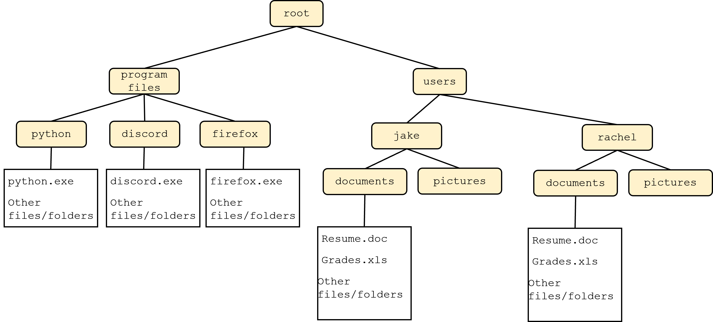

# Mod 1 Lab - Python Fundamentals

Welcome to the first lab! A few things as you get started:

* You will work on and submit labs (but not homework assignments) with a partner in your lab section.
* You'll earn lab participation by working with your partner throughout lab. To earn full participation credit:
   * Come to lab on time.
   * Work with your partner.
   * Stay until you are finished or the lab ends.
   * Avoid starting the lab early. This is a good impulse in general, but it robs you and your partner of the chance to work together under the supervision of your TA.

* Each lab has a coding and a conceptual portion. This is the coding portion.

This lab will walk you through the process of the coding and conceptual portions of lab:

* Coding portion of each lab:
   * navigating your computer's file structure
      * create new files and folders
   * writing python code
   * running python code
   * submitting code to gradescope
* Conceptual portion of each lab:
   * quiz on HCT, with the same due dates as lab (should finish no later than Friday on a typical week. You can submit as late as Sunday, but that will put you behind for the homework/starting the next week.)
   * you get 4 tries on each quiz. It's a good idea to complete at least 1 try before coming to the coding lab, to ensure you're familiar with the week's concepts.

## Part 1 - Setup your filesystem

All modern operating systems use a hierarchal file structure. We can think of this as a tree - the top level directory, often referred to as `root`, contains all the files and folders on your computer. The exact names of various folders changes based on your operating system, but the general structure is a root directory which contains both the files necessary for various prorams to run and the files created and used by individual users:


It's often nice to collapse this visual diagram to a text-based one, like this:

```
|root
|  |program files
|  |  |python
|  |  |--python.exe
|  |  |--(other files/folders)
|  |
|  |  |discord
|  |  |--discord.exe
|  |  |--(other files/folders)
|  |  
|  |  |firefox
|  |  |--firefox.exe
|  |  |--(other files/folders)
|
|  |users
|  |  |jake
|  |  |  |documents
|  |  |  |--Resume.docx
|  |  |  |--Grades.xls
|  |  |  |--(other files/folders)
|  |  |
|  |  |  |pictures
|  |
|  |  |rachel
|  |  |  |documents
(omitted for space)
```

For this class, we want to create a folder called `cse2050` in your user's directory. On your lab PC, your username will be your netID (e.g. `jas14034`). Then, create a subfolder called `labs`, and another called `lab1`. Put a file called `hello.py` inside of that folder. Your ultimate file structure should look something like this:

```
|root
|  |users
|  |  |jas14034
|  |  |  |cse2050
|  |  |  |  |labs
|  |  |  |  |  |lab1
|  |  |  |  |  |--hello.py
|  (other users omitted)
|
|  |program files
|  |  (program files omitted)
```

Open the folder `lab1` in an **i**ntegrated **d**eveloping **e**nvironment (IDE) of your choice, add some code to print something out, and run it. The lab PCs include Visual Studio Code, which most students use, but you are free to use whatever you want on your local PC for homework assignments.

This can all be a little overwhelming the first time you see it. If you're not sure how to create a folder on your computer, ask around - another classmate or your TA can help. It's important that we get used to asking each other for help; it will make the rest of this course much smoother.

**STOP** - at this point, you *and your partner* should be able to navigate the file structure on your computer, including creating files. You should also be able to write a basic python script, run it, and see its output. Make sure you are comfortable with the above (ask classmates or the TA if you need assistance) before moving on.

## Part 2 – Modifying `hello.py`

Now that your comfortable with your comptuer's file system, it's time to write some more intricate Python code. Add a function `say_hi()` to the file `hello.py` you just made. This function should just return the string `Hello, world` for now.

**Important: `return` and `print` are subtly different commands. This function should _return_ a value, not print it out.**

```python
def say_hi():
   return "Hello, world"
```

## Part 3 - Submit code to Gradescope

Next, we'll submit our code to Gradescope. Click the `Gradescope` link in HuskyCT, then select the appropriate assignment. Submit the file `hello.py` you made earlier.

The autograder takes a minute or two to run. Once it completes, you should see 10/100 points for this assignment if `hello.py` is correct. Read over the error messages for the test cases you failed to get an idea of why they failed (largely, they depend on the file `lab1.py`, which you have not yet created and did not submit.)

**STOP** - make sure your partner are here before continuing.

## Part 4 - Rinse and repeat

Now, we'll continue to work on our code and re-submit until we pass all test cases. To complete this assignment, create a new file called `lab1.py`. This file should have a single function named `generic_hi()` which takes one *optional* argument: a name to add to the return string:

```python
>>> generic_hi('jake') # We can specify a name
'Hello, jake!'
>>> generic_hi('greninja')
'Hello, greninja!'
>>> generic_hi() # We can call the function without specifying
'Hello, world!'
```

Note that your function needs a default value (`'world'` in this case) to plug in to the return string if the user does not specify one. If you're not sure how to do this, try to look it up online (e.g. go to google and search "python function default values"). This is a good chance to practice learning-through-documentation, a critical skill for computer scientists. Of course, if you get stuck, feel free to ask your lab partner, a nearby group, or your TA, or to make a post on the course Discord.

## Part 5 - Conceptual Quiz

Each module has a conceptual quiz to complement the lab. These quizzes are worth 5% of your total grade (the coding portion of lab is 10%, so labs constitute a total of 15% of your grade). You can find these quizzes in HuskyCT.

* Each quiz allows 4 attempts
* After each attempt, you can see which questions you missed
* Each quiz includes a 0-point "hand-written code" question to help you prepare for exams

Quizzes will typically be available by the day before labs (Wednesdays). It's a good idea to try them at least once before lab, to ensure you have the appropriate conceptual background.

## External Modules

**Do not use any imported modules (`math`, `collections`, ...) when implementing functionality.** It is okay to use imported modules for testing.

It is okay to import modules you write yourself; e.g. any data structures you write yourself.

## Submitting

**STOP!**. Before you go, make sure to backup your files using a cloud service like Onedrive.

At a minimum, submit the following files for this lab:

   * `hello.py`
   * `lab1.py`

Students must submit by the due date (typically, Friday at 11:59 pm EST) to receive credit.