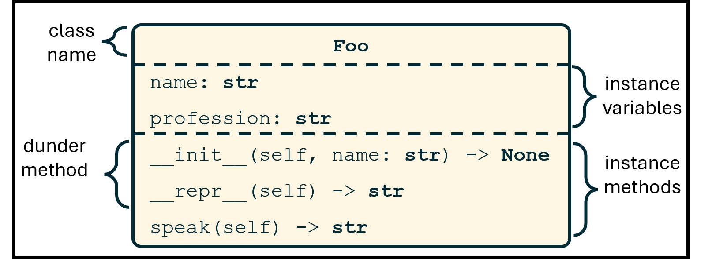
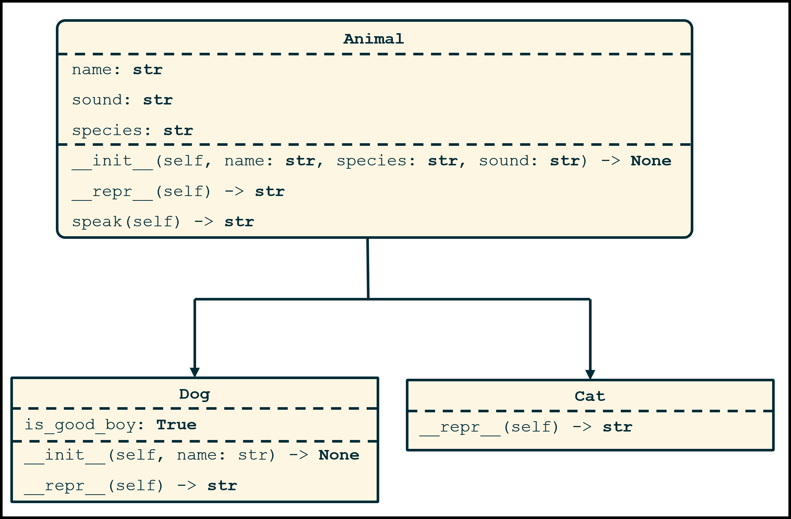

# Mod 2 Lab: Object-Oriented Animals

We start by seeing classes as factories for generating namespaces - `class Foo`. Then, we use object-oriented programming (OOP) to create new types of objects - Animals, and their subtypes, Dogs and Cats.

This lab includes test cases in `test_1foo.py` and `test_2animals.py`. When you are ready, you can run those files. They import the classes you will write in `Foo.py` and `Animals.py` and run tests on them, printing out results in terminal:
```bash
$ python ./test_1foo.py
...
----------------------------------------------------------------------
Ran 3 tests in 0.000s

OK
```
We'll learn how to write our own unittests like this next week, as part of Test Driven Development.

## Part 1: Classes as namespace factories

You can think of a class as a factory for generating namespaces. In the example below, we create an empty class, create an instance of that type, then add a variable and a function to that instance's namespace:

```bash
>>> class Foo:
...     pass
...
>>> my_foo = Foo() # create an instance of type Foo, store it in variable my_foo
>>> type(my_foo)
<class '__main__.Foo'>
>>> my_foo.name = 'jake' # add variable to namespace
>>> my_foo.name # retrieve a variable from namespace
'jake'
>>> # Create a function for speaking
>>> def speak(obj):
...     return f"{obj.name} says hello!"
...
>>> my_foo.speak = speak # Add function to namespace
>>> my_foo.speak(my_foo) # call function in namespace.
'jake says hello!'
```

### Default variables and methods

This works well enough - I now have an object that I can attach variables and functions to. One problem with this approach is that, if I decide to make a second `Foo` type object, I have to manually reattach all variables and functions. To help with this, Python allows me to define variables when creating a class. These variables are assigned when an object is initialized using the method `__init__`:

```python
>>> class Foo:
...     def __init__(self, name):
...         self.name = name
...
>>> my_foo1 = Foo('jake') # create an instance of type Foo, specifying name
>>> my_foo2 = Foo('rachel') # another object
>>> my_foo1.name, my_foo2.name    # retrieve from namespace
('jake', 'rachel')
```

Now I can easily create as many objects as I want with a certain name.

### The dreaded `self`

The `self` parameter used above is a tricky concept for many people when they start OOP. I think it's helpful seeing where it came from.

Looking back at our first example, there is a relatively minor inefficiency that drives computer scientists wild:

```python
>>> my_obj.speak(my_obj)
```

I've had to type out "`my_obj`" twice - once to specify the namespace to find the function, and once to specify the variable passed to the function. If I instead define that function within the class `Foo`, then any objects that call that function will automatically pass themselves in as the first parameter. I'll be able to use `my_obj.speak()`, and Python will recognize `my_obj` as the namespace *and* pass it as the first parameter to the function. To help us remember this while writing methods, we will always call the first parameter `self`:

```python
>>> class Foo:
...     def __init__(self, name):
...         self.name = name
...     def speak(self):
...         return f"{self.name} says hello!"
...
>>> my_foo1 = Foo('jake')
>>> my_foo2 = Foo('rachel')
>>> my_foo1.speak(), my_foo2.speak()
('jake says hello!', 'rachel says hello!')
```

### Printable objects

We will use `__repr__` to tell Python what a string representation of our object is. We inherit `__repr__` from `object`, the base class of all Python classes, but the results are not particularly useful:

```python
>>> print(my_foo1)
<__main__.Foo object at 0x00000116E8B22E70>
```
The class and memory location are better than nothing, but we should aim higher. Let's overload `__repr__` to give us something more useful:

```python
>>> class Foo:
...     # define init and speak as above
...     def __repr__(self):
...         return f"Foo({self.name})"
...
>>> my_foo1 = Foo('jake')
>>> my_foo1
Foo(jake)
```

### Your Turn

Create a class called `Foo` just like the one above, but add two parameters during initialization - `name` and `profession`.

## UMLs

We will often give you Unified Modeling Language diagrams (UML diagrams) of classes we want you to create. These are visual representations showing important names and types:

* The names and types of all instance variables
* The names of all instance methods
* The parameters and types of all instance methods (except `self`, whose type is assumed to be the class we are working with)
* The return type for all instance methods

The UML class diagram for Foo looks like this:



`__init__()` returns the `None` object - this is the default. When python reaches the end of a function without seeing a `return` statement, it returns `None`.

`__init__()` is a **dunder**, or **magic** method. It begins and ends with **d**ouble **under**scores. Dunder methods are called in a special way. `init` is called when an object is created, even though we don't explicilty call it. Other common dunder methods are `__len__` (called as `len(my_obj)`) and `__eq__` (called as `obj1 == obj2`).

For good readability: (almost) **never call dunder methods with their full dunder titles**. That is, it's better to say `len(my_obj)` then `my_obj.__len__()`, even though python will allow either. The exception is `__init__`, which we will sometimes call with its dunder title in child classes (see below) because python does not provide another way to access it.

UMLs are great. From a good UML, you can intuit how a class works, even if you can't see the code. Good variable and function names, as well as explicit type specifications, give us a lot of information.

## Part 2 - Animals

Let's make some classes that are more useful than `Foo`. We'll use a parent class `Animal` that has two children: `Dog` and `Cat`.

We inherit from a parent by specifying it in parentheses when making a class:

```python
class Dog(Animal): # This class inherits all variables and methods from Animal
    pass
```

The code above allows me to use `Dog` exactly like I would `Animal`. The beauty of object-oriented programming comes from specialization - I can add certain variables or methods that only apply to `Dog`s, but not all `Animal`s, without having to redefine everything that `Dog`s share with other `Animal`s. For instance, if I wanted animals to be initialized with a name, sound, and species, I might say:

```python
class Animal:
    def __init__(self, name, species="animal", sound="hi"):
        self.name = name
        self.species = species
        self.sound = sound
```

If `Dog`s should be initialized the same way, but also with a good boy flag set, I could write:
```python
class Dog:
    def __init__(self, name, species="dog", sound="ruff", is_good_boy = True):
        self.name = name
        self.species = species
        self.sound = sound
        self.is_good_boy = is_good_boy
```

Much of this code is repeated. I will instead inherit from `Animal`, overload `__init__`, and call my parent (or "super") class with the correct parameters.

```python
class Dog(Animal):
    def __init__(self, name, species="dog", sound="ruff", is_good_boy = True):
        super().__init__(name, species, sound)
        self.is_good_boy = is_good_boy
```

I can even reduce the number of parameters in `Dog.__init__`, since all dogs are of the species `"dog"` and say `"ruff"`:

```python
class Dog(Animal):
    def __init__(self, name, is_good_boy = True):
        super().__init__(name, "dog", "ruff")
        self.is_good_boy = is_good_boy
```

This is the one time you should call a dunder method by it's double-underscore name: when we need to call our parent classes' initialization method before adding a few instance variables that are only appropriate for this child class.

A neat thing about inheritance is that any other methods we had defined in our parent are available to us. If we defined a method called `speak` in `Animal`, then `Dog` objects can use it, even though it's not defined:

```python
>>> d1 = Dog('fido', 'mutt') # __init__ is found in Dog
>>> d1.speak() # speak() not found in Dog, so python searches parent, Animal
fido, a dog, says ruff!
```

Now, it's your turn. Define an `Animal` class that supports:

* `__init__()`
* `speak()`
* `__repr__()`

As well as children classes `Dog`:

* `__init__()` (calls parent's `init`, then adds `is_good_boy` flag)
* `__repr__()` 

and `Cat`:

* `__repr__()`

Your code should reflect this class diagram:



And behave like this:
```python
>>> a1 = Animal("Arthur", "Ardvark")
>>> d1 = Dog('Doug')
>>> c1 = Cat('Caroline', 'calico cat', 'meow')
>>> print(a1, d1, c1)
Animal(Arthur, Ardvark, hi) Dog(Doug) Cat(Caroline, calico cat, meow)
>>> print(a1.speak(), d1.speak(), c1.speak())
Arthur, a Ardvark, says hi! Doug, a dog, says ruff! Caroline, a calico cat, says meow!
```

## Part 3 - Conceptual Quiz

Don't forget the quiz in HuskyCT! As a lab, you can ask your TA for the answer to one question on the quiz - choose carefully. We won't remind you of the conceptual quiz components of labs in future assignments.

## Submitting

**STOP!**. Before you go, make sure to backup your files using a cloud service like Onedrive.

At a minimum, submit the following files for this lab:

   * `Foo.py`
   * `Animals.py`

Students must submit by the due date (typically, Friday at 11:59 pm EST) to receive credit. You can submit in a group of up to 2 students in your lab section.